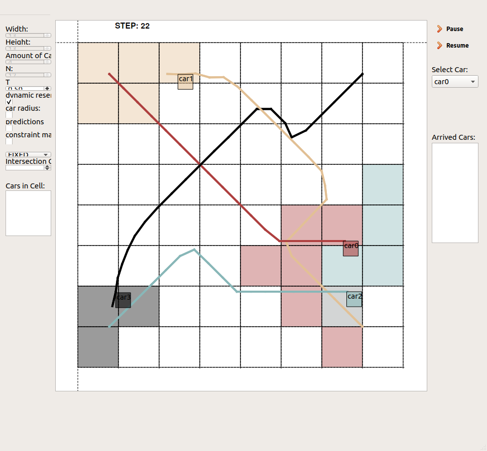

## DMPCRobotSimulation

# Description

In short: This is a non-cooperative distributed model predictive control (DMPC) robot simulation on a 2D plane, where each robot/agent/vehicle acts based on a local controller. To reduce the communication effort to ensure collision avoidance constraints, an occupancy grid is used to reduce the communication burden. Publications, which describes the overall scenario in detail are published [here](https://linkinghub.elsevier.com/retrieve/pii/S002002551830286X) and [here](https://www.mdpi.com/2076-3417/10/3/1007).

## Preliminaries

What is [Model Predictive Control](https://en.wikipedia.org/wiki/Model_predictive_control)?
What is [Distributed Model Predictive Control] (https://ieeexplore.ieee.org/document/946306)?

## Detailed description 
This scenario describes a 2D plane, where different agents (e.g. robots, vehicles, etc.) given fixed start positions try to achieve their individual targets while ensuring collison avoidance between each other. In the preset, start and targets are given in the edges of the 2D space and the agents have to traverse diagonal to reach their target. Each robot is under the regime of a local controller, which calculates the next movements, here control based on the received prediction of the other robot. The order is fixed (or calculated by a priority rule) while each robot solves an Optimal Control Problem [(OCP)](https://en.wikipedia.org/wiki/Optimal_control). The costs are roughly spoken the distance between current position and given individual target. The constraints depict the distances, which have to be kept to the other robots. 
### Underlying Model
Herein, a holonomic model is used for each simulated robot and for each robot, an online MPC controller is applied. Start and target positions are predefined (on diagonal directions opposite to each other). The 2D plane is quantised onto an occupancy grid. 

### Communication
Each robot requests and communicate the requested cells based on this occpuancy grid, where the cells are discretised in an equidistant manner. 

# Requirements

1. Qt5 (open-source, https://qt.io)
2. nlopt (https://github.com/stevengj/nlopt)
3. QwtPlot (https://qwt.sourceforge.io/)

#Usage

This project is licensed under MIT license. If you use this code (also partially), I would appreciate if you would kindly cite then DMPCRobotSimulation by

T. Sprodowski, A DMPC Robot Simulation, https://github.com/SirTobias/DMPCRobotSimulation

Thank you.